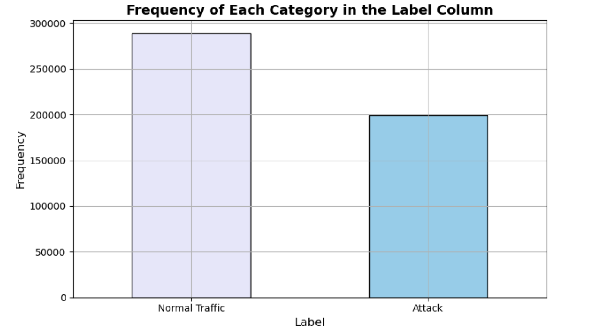
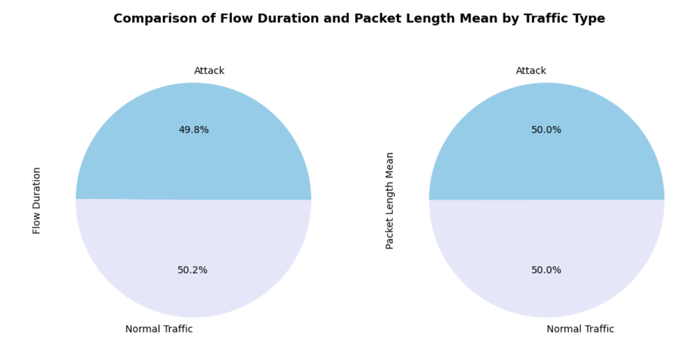
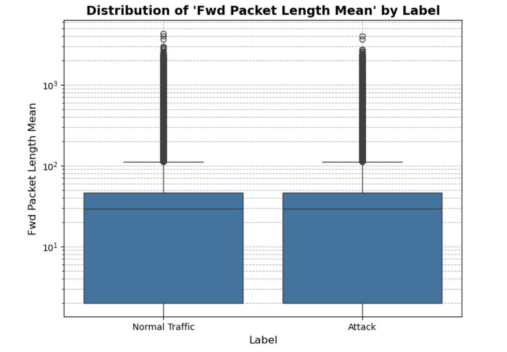

# 🌐 Smart Data Discovery: Network Traffic Analysis

## 📌 Overview

This project demonstrates Python-based data analysis of network traffic, focusing on understanding flow characteristics, exploring patterns, and preparing the dataset for potential intrusion detection using machine learning.

---

## 🚀 Key Insights
- ⚡ Attack traffic shows distinct behavioral patterns compared to normal traffic  
- 📊 A small set of features strongly influences traffic classification  
- 📉 Flow duration and packet sizes vary significantly between normal and attack traffic  
- 🔗 Several features are highly correlated, indicating redundancy  
- 🚨 Clear statistical differences exist between benign and malicious traffic 

---

## 📊 Analysis Performed

### 1. Data Understanding
- Explored dataset structure and key columns  
- Summarized important features and their significance  

### 2. Data Preparation
- Loaded dataset into a pandas DataFrame  
- Selected relevant columns for analysis  
- Handled missing values and removed duplicates  
- Renamed labels:  
  - `BENIGN` → Normal Traffic  
  - `Infiltration` → Attack  

### 3. Data Analysis
- Calculated summary statistics (sum, mean, standard deviation, skewness, kurtosis)  
- Performed correlation analysis and identified top 5 correlated features  

### 4. Data Exploration & Visualization
- Bar chart showing frequency of Normal Traffic vs Attack  
- Pie charts for average Flow Duration and Packet Length Mean by label  
- Boxplots for 'Fwd Packet Length Mean' grouped by label  
- Insights on differences between traffic types  

### 5. Hypothesis Testing
- Tested whether mean Flow Duration differs between Normal Traffic and Attack  
- Stated null and alternative hypotheses  
- Performed appropriate statistical test and interpreted results  

---

## 🧰 Tech Stack
- **Python**
- **Pandas** – Data manipulation  
- **NumPy** – Numerical computation  
- **Matplotlib / Seaborn** – Data visualization  
- **Jupyter Notebook**

---

## 📂 Project Structure

```text
📁 Network_Traffic_Analysis/
│
├── Network_Traffic_Analysis.ipynb    # Main analysis notebook
├── Network_Traffic_Analysis.pdf      # Clean report version
├── Network_Traffic_Analysis.html     # Exported interactive notebook (HTML version)
├── ids.csv                           # Sample dataset (network traffic data)
├── images                            # sample visualization
└── README.md
```

---

## ⚙️ How to Run
1. Clone the repository
  git clone <your_repo_url>
2. Open the notebook in Jupyter or VS Code
3. Ensure the dataset (ids.csv) is in the same directory
4. Run all cells to reproduce the analysis

---

## 📸 Sample Visualizations

### Bar Chart - Label Frequency


### Pie Chart - Flow Duration & Packet Length


### Box Plot - Fwd Packet Length Mean


---

## 🎯 What I Learned
- Working with real-world network traffic datasets
- Cleaning and preparing data for analysis
- Performing exploratory data analysis (EDA)
- Identifying patterns in normal vs attack traffic
- Applying statistical reasoning to cybersecurity data
- Visualizing complex network behavior

---

## 💡 Future Improvements
- Build a machine learning model for intrusion detection
- Create a real-time network monitoring dashboard
- Improve feature selection using ML techniques
- Deploy as an interactive web application

---

## 👤 Author
**Sadikshya Karki**
